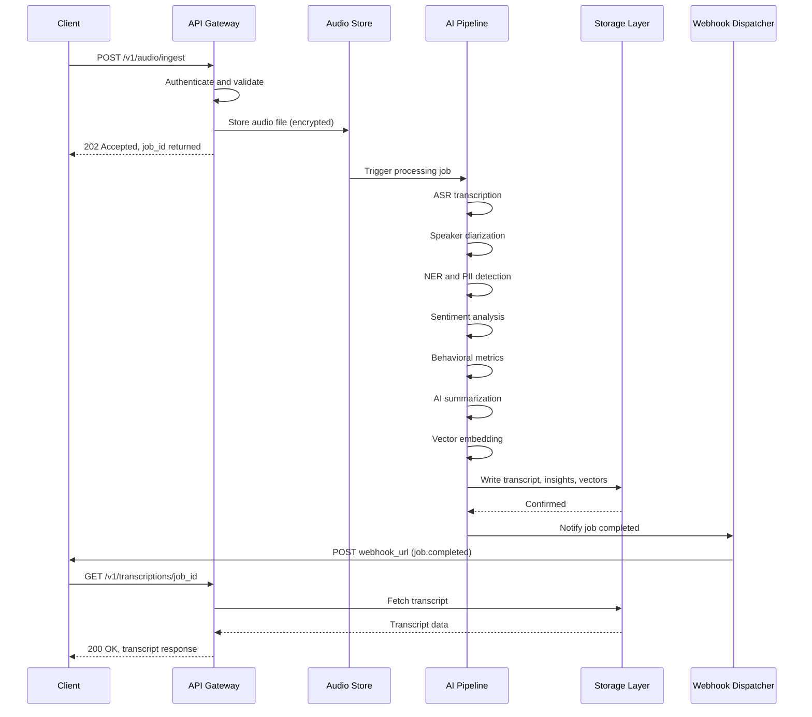

# Data Flow

This page traces the complete journey of an audio file through the
NovaPulse platform, from upload to the moment results are available
via the API.

---

## End-to-end flow

---

## Step-by-step breakdown

### 1. Upload and validation

The client sends a `multipart/form-data` POST request to
`/v1/audio/ingest`. The API Gateway authenticates the request,
validates the file format and size, and returns a `202 Accepted`
response with a `job_id` immediately. The client does not wait
for processing to complete.

### 2. Audio storage

The validated audio file is stored in encrypted object storage.
Storage is isolated per tenant. The file is assigned a unique
internal identifier linked to the job record.

### 3. ASR transcription

The transcription engine processes the audio and produces a raw
text transcript with word-level timestamps and confidence scores.
This is the most computationally intensive step. For a 5-minute
call, transcription typically completes in under 30 seconds.

### 4. Speaker diarization

The diarization engine segments the transcript by speaker, assigning
consistent labels throughout the call. Diarization runs on the audio
waveform in parallel with transcription and is merged with the
transcript output at this step.

### 5. NER and PII detection

The named entity recognition model scans the transcript for personally
identifiable information: names, phone numbers, email addresses, account
numbers, and dates of birth. Detected PII is redacted before the
transcript is written to storage.

### 6. Sentiment analysis

The sentiment model scores each speaker-attributed segment on a scale
from -1.0 to +1.0. An overall call sentiment score and trend
classification are calculated from the segment scores.

### 7. Behavioral metrics

Conversation dynamics are calculated from the diarized transcript:
silence ratio, interruption count, talk ratio per speaker, and
average response time between speakers.

### 8. AI summarization

A large language model generates a concise summary of the conversation,
grounded in the actual transcript text. The summary covers the reason
for the call, key topics, outcome, and recommended follow-up actions.

### 9. Vector embedding

Each transcript segment is converted to a dense vector embedding and
written to the vector index. This step runs in parallel with
summarization and enables semantic search across all stored
conversations after the job completes.

### 10. Results available

All results are written to the storage layer. The job status is updated
to `completed`. If a `webhook_url` was provided at upload, the Webhook
Dispatcher sends a `job.completed` notification to the client.

The client can now retrieve results via:

- `GET /v1/transcriptions/{job_id}`
- `GET /v1/insights/{job_id}`

---

## Processing times

Processing time depends on audio duration and current queue depth.
Typical times for the `full-analysis` pipeline:

| Audio duration | Typical processing time |
|---|---|
| Under 5 minutes | 30 to 90 seconds |
| 5 to 15 minutes | 90 seconds to 4 minutes |
| 15 to 60 minutes | 4 to 15 minutes |
| Over 60 minutes | 15 minutes or more |

!!! note
    These are typical times under normal load. During high-demand periods,
    processing times may be longer. Use webhooks rather than polling
    to avoid unnecessary load on your integration.

---

## Asynchronous design

NovaPulse uses an asynchronous processing model by design. The upload
endpoint returns immediately so that your application is never blocked
waiting for a long-running AI pipeline to complete. This makes it
straightforward to process large batches of audio files in parallel
without managing timeouts on long-running HTTP connections.

---

## Related

- [System Overview](system-overview.md)
- [Security and Compliance](security.md)
- [Audio Ingestion API](../api-reference/audio-ingestion.md)
- [NLP Capabilities](../concepts/nlp-capabilities.md)

