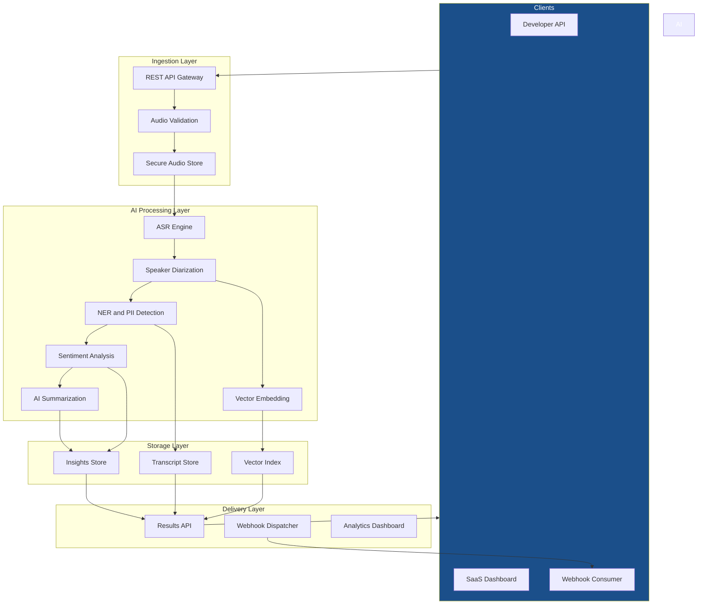

# System Overview

NovaPulse is built on a cloud-native, multi-tenant architecture designed
for reliability, scalability, and data isolation. This page describes the
platform's core components and how they work together.

---

## Architecture diagram

---

## Core components

### API Gateway

The API Gateway is the single entry point for all client requests. It handles:

- Authentication and API key validation
- Request routing to the appropriate internal service
- Rate limiting enforcement per API key
- TLS termination

All traffic to NovaPulse passes through the API Gateway. No internal
services are directly accessible from outside the platform.

### Audio Validation and Storage

When an audio file is uploaded, it passes through a validation step that
checks file format, encoding, size, and duration before storage. Valid
files are stored in encrypted object storage with a unique identifier
tied to the processing job.

Audio files are retained for 90 days by default and are never shared
across tenant boundaries.

### AI Processing Pipeline

The processing pipeline runs as a sequence of independent services.
Each service receives the output of the previous step and adds its
own structured data to the job record. See
[Data Flow](data-flow.md) for the step-by-step sequence and
[NLP Capabilities](../concepts/nlp-capabilities.md) for details
on each AI model.

### Vector Index

After transcription and diarization, each transcript segment is converted
to a dense vector embedding and stored in the vector index. This enables
semantic search across all conversation data. See
[Vector Search](../concepts/vector-search.md) for how this works.

### Results API

The Results API serves completed job data to clients: transcripts,
sentiment analysis, behavioral metrics, and AI summaries. All results
are served from the storage layer; the AI processing pipeline does
not run again on read requests.

### Webhook Dispatcher

When a job completes, the Webhook Dispatcher sends a POST notification
to the client's configured `webhook_url`. It handles retries with
exponential backoff and logs delivery status per job.

---

## Multi-tenancy and isolation

NovaPulse is a multi-tenant platform. All data is isolated at the
storage layer using row-level security: no tenant can access another
tenant's audio, transcripts, or insights under any circumstances.

API keys are scoped to a single tenant. There is no cross-tenant API
access path.

---

## Cloud infrastructure

NovaPulse is deployed exclusively on cloud infrastructure. There is no
on-premise option in v1.0. The platform is designed for horizontal
scalability: processing nodes scale automatically based on job queue depth.

---

## External integrations

| Service type | Purpose | Integration method |
|---|---|---|
| Third-party ASR provider | Fallback transcription for edge cases | REST API |
| LLM provider | AI summarization and recommendations | Inference API |
| CRM systems | Ticket and call record linking via metadata | Metadata field mapping |
| VoIP and WebRTC platforms | Real-time audio stream ingestion (Phase 2) | WebRTC stream |

---

## Related

- [Data Flow](data-flow.md) — Step-by-step data flow through the pipeline
- [Security and Compliance](security.md) — Encryption, PII, and GDPR
- [NLP Capabilities](../concepts/nlp-capabilities.md)
- [Vector Search](../concepts/vector-search.md)

