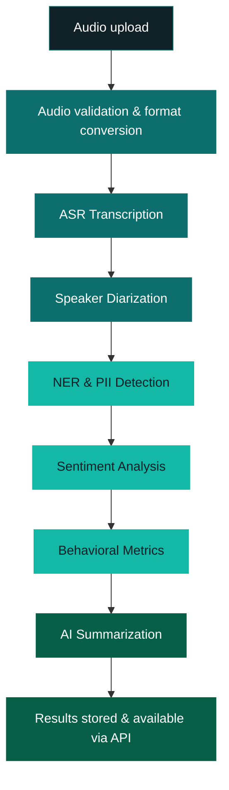

# NLP Capabilities

NovaPulse uses a pipeline of natural language processing (NLP) models to
transform raw audio into structured data. Each capability runs automatically
when you process audio with `pipeline=full-analysis`.

---

## Automatic Speech Recognition (ASR)

ASR, also called transcription, converts spoken audio into text.
NovaPulse's transcription engine is optimized for telephone-quality audio
and multi-speaker conversations.

**Performance targets:**

| Condition | Accuracy |
|---|---|
| Clear audio, single speaker | ≥96% |
| Multi-speaker, standard quality | ≥90% |
| Background noise or heavy accent | ≥82% |

Accuracy is measured as word error rate (WER) against human-verified
transcripts across a diverse test set.

---

## Speaker Diarization

Diarization answers the question: *who spoke when?*

NovaPulse's diarization engine segments the audio by speaker and assigns
a consistent label to each speaker throughout the call : `Agent`,
`Customer`, or `Speaker N` for calls with more than two participants.

Diarization runs in parallel with transcription so that every transcript
segment is speaker-attributed from the start.

!!! note
    Speaker labels are assigned based on conversation patterns, not voice
    enrollment. For calls with very similar voice profiles, label accuracy
    may be lower. Voice enrollment for improved accuracy is planned for v1.2.

---

## Sentiment Analysis

NovaPulse scores each transcript segment on a continuous sentiment scale
from -1.0 (strongly negative) to +1.0 (strongly positive), and produces
an overall call sentiment classification.

The sentiment model is trained on customer service conversation data and
is optimized for detecting:

- Customer frustration and dissatisfaction
- Positive engagement and satisfaction signals
- Sentiment shifts during the conversation (trend detection)
- High-risk moments requiring supervisor intervention

See [Sentiment Analysis API](../api-reference/sentiment-analysis.md) for
the full response schema.

---

## Named Entity Recognition (NER)

NER identifies and classifies named entities in transcript text. NovaPulse
uses NER for two purposes:

**PII detection:** Identifies names, phone numbers, email addresses, account
numbers, dates of birth, and other personally identifiable information so
they can be automatically redacted before storage.

**Structured data extraction:** Extracts business-relevant entities : product
names, company names, locations, and dates, to enable downstream filtering
and search.

---

## AI Summarization

NovaPulse generates a concise summary of each conversation automatically,
covering:

- The primary reason for the call
- Key topics discussed
- Outcome or resolution status
- Recommended follow-up actions

Summaries are generated using a large language model grounded in the actual
transcript text not hallucinated. The transcript content is used as the
context, ensuring the summary accurately reflects what was said.

---

## Behavioral Analytics

Beyond language, NovaPulse measures conversation dynamics:

| Metric | Description |
|---|---|
| **Silence ratio** | Proportion of the call spent in silence — high values indicate hold time or confusion |
| **Interruption count** | Number of times either speaker interrupted the other |
| **Talk ratio** | Proportion of speaking time per speaker — helps identify agent-dominated calls |
| **Average response time** | Mean time between speakers — long gaps may indicate confusion or hesitation |

---

## Processing pipeline

When you upload audio with `pipeline=full-analysis`, NovaPulse runs
these steps in sequence:

---

## Related

- [Platform Overview](platform-overview.md)
- [Vector Search](vector-search.md) — Semantic search across transcripts
- [RAG Pipeline](rag-pipeline.md) — AI-driven question answering
- [Sentiment Analysis API](../api-reference/sentiment-analysis.md)
- [Transcription API](../api-reference/transcription.md)

