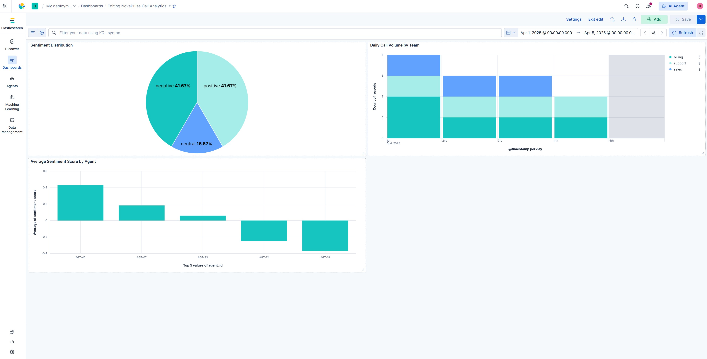

# Build a Lens dashboard

Kibana Lens is the default drag-and-drop visualization editor. It lets you
build charts by dragging fields from a data view onto a workspace, and
suggests the most appropriate visualization type based on the data.
This page documents building a 3-panel NovaPulse call analytics dashboard.

**Official reference:** [Lens](https://www.elastic.co/docs/explore-analyze/visualize/lens)

---

## Create the dashboard

1. Click **Dashboards** in the left sidebar
2. Click **Create dashboard**
3. Set the time range to **April 1 to April 5, 2025**
4. Click **Save** and name it: `NovaPulse Call Analytics`

---

## Visualization 1: Sentiment Distribution (Pie chart)

This chart shows the proportion of calls by sentiment classification,
giving a quick overview of overall call quality for the period.

### Build it

1. Click **Add panel > Create visualization**
2. In the chart type selector, choose **Pie**
3. Drag **overall_sentiment** from the field list to the **Slice by** dimension
4. Drag **Records** to the **Metric** dimension
5. Click **Save and return**
6. In the panel header, click the three-dot menu and select **Edit panel title**
7. Title it: `Sentiment Distribution`

### What you see

A pie chart with three slices: negative, neutral, and positive.
With 12 sample records the split is 5 negative, 4 positive, 3 neutral.

### Why this chart type

Pie charts work well for part-to-whole comparisons with 3 to 5 discrete
categories. Sentiment classification has exactly three values, making
this an appropriate choice. The proportions communicate call quality
at a glance without requiring the viewer to read axis values.

---

## Visualization 2: Daily Call Volume by Team (Stacked bar chart)

This chart shows how many calls each team handled per day, stacked to
show both individual team volume and daily totals.

### Build it

1. Click **Add panel > Create visualization**
2. Leave the chart type as **Bar Stacked**
3. Drag **@timestamp** to the **Horizontal axis**
4. Drag **team** to the **Breakdown** dimension
5. Drag **Records** to the **Vertical axis**
6. Click on **@timestamp** in the Horizontal axis and set the interval to **1 day**
7. Click **Save and return**
8. Title it: `Daily Call Volume by Team`

### What you see

A stacked bar chart with one bar per day, each divided by team color:
billing, support, and sales. The height shows total daily call volume.

---

## Visualization 3: Average Sentiment Score by Agent (Bar chart)

This chart shows each agent's average sentiment score across all their calls,
making it easy to identify which agents handle the most difficult calls
or perform best.

### Build it

1. Click **Add panel > Create visualization**
2. Change the chart type to **Bar vertical** (or Bar)
3. Drag **agent_id** to the **Horizontal axis**
4. Click the **agent_id** dimension and set the function to **Top values**, number of values to **5**
5. Drag **sentiment_score** to the **Vertical axis**
6. Click the **sentiment_score** dimension, set function to **Average**, and set the label to `Avg Sentiment Score`
7. Click **Save and return**
8. Title it: `Average Sentiment Score by Agent`

### What you see

A bar chart with one bar per agent. Bars above zero indicate a net-positive
average sentiment across that agent's calls. Bars below zero indicate
net-negative, those agents are handling the most difficult interactions
or may need coaching support.

In the sample data: AGT-42 performs best with an average around +0.43,
while AGT-19 scores lowest at around -0.37.

!!! tip "Lens suggestions"
    As you configure dimensions, Lens displays alternative visualization
    suggestions at the bottom of the editor. For the agent sentiment chart,
    Lens also suggested a data table showing exact scores per agent alongside
    the bar chart. Both are useful: the chart for quick visual comparison,
    the table for precise values. Consider adding both to a production dashboard.

---

## Inspect the underlying Elasticsearch query

Every Lens visualization sends an Elasticsearch aggregation query behind
the scenes. To see it:

1. Hover over any panel on the dashboard
2. Click the three-dot menu, then select **Inspect**
3. Click **Request**

For the sentiment pie chart, you will see a `terms` aggregation on the
`overall_sentiment` field. For the agent sentiment chart, you will see
an `avg` aggregation on `sentiment_score` grouped by `terms` on `agent_id`.
This is useful for understanding how Lens translates visual configuration
into Elasticsearch query DSL, and for replicating the same query via the API.

---

## Related

- [Explore with Discover](explore-with-discover.md)
- [Index NovaPulse data](index-novapulse-data.md)
- [Kibana Lens documentation](https://www.elastic.co/docs/explore-analyze/visualize/lens)
- [Supported chart types](https://www.elastic.co/docs/explore-analyze/visualize/supported-chart-types)
